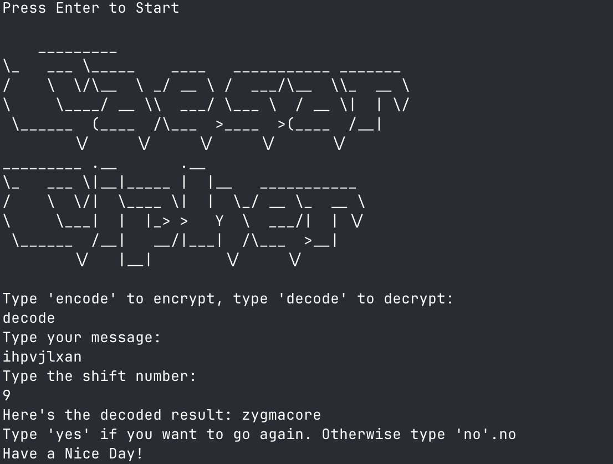

<h1 align="center">CipherSprint CLI</h1>

<p align="center">
  
  
  
</p>

<p align="center">
  
</p>

<h3 align="center">
  Lightning-fast Caesar cipher assistant for instant message shifts.
</h3>

---

## 📘 About The Project

CipherSprint CLI is a lightweight, terminal-native Caesar cipher utility built for the 100 Days of Python coding journey. It keeps the workflow focused on text transformations while showcasing how simple loops, modular arithmetic, and data structures can deliver a helpful encryption sandbox.

- Instant encode/decode loops without restarting the program
- Non-alphabet characters pass through untouched for clarity
- ASCII art guidance to make the CLI feel inviting

Built for:
- Course participants sharpening Python fundamentals
- Puzzle makers prototyping secret hints
- Curious tinkerers wanting a dependable cipher helper

---

### 💡 Why This Project Exists

CipherSprint CLI eliminates manual Caesar calculations, gives learners a predictable CLI rhythm for repeated experimentation, and keeps punctuation plus spacing intact so the output stays readable. Its goals are to reinforce string manipulation, provide immediate feedback while practicing encryption concepts, and act as a launchpad for more sophisticated cipher ideas.

---

## 🖼 Screenshot




---

## 🛠 Tech Stack

| Technology | Usage |
| --- | --- |
| Python 3.11 | Core CLI logic and user interaction |
| Standard Library (os) | Screen clearing and terminal UX polish |
| Custom Module (module.py) | ASCII banner plus centralized alphabet data |

---

## ✨ Key Features

- Guided encode/decode prompt cycle that loops until you exit
- Modular arithmetic ensures both positive and negative shifts behave correctly
- Preserves numbers, whitespace, and punctuation right where you expect them
- Striking ASCII art banner sets a playful tone before each run
- Zero-dependency footprint so it works anywhere Python is installed
- Cleanly clears the screen between sessions for distraction-free focus

---

## 🚀 Getting Started

### Prerequisites
- Python 3.11+
- Terminal access on macOS, Linux, or Windows

### Installation

```bash
git clone https://github.com/ZygmaCore/caesar-cipher-cli.git
cd caesar-cipher-cli
python3 -m venv .venv
source .venv/bin/activate  # On Windows use: .venv\Scripts\activate
```

This project relies solely on the Python standard library, so no additional packages are required once the virtual environment is active.

### ▶️ Usage

Copy code

```bash
python3 main.py
```

#### Example Output

```text
Press Enter to Start 
Type 'encode' to encrypt, type 'decode' to decrypt:
encode
Type your message:
hello world
Type the shift number:
5
Here's the encoded result: mjqqt btwqi
Type 'yes' if you want to go again. Otherwise type 'no'.no
Have a Nice Day!
```

---

## 🤝 Contributing

1. Fork the repository.
2. Create a feature branch (`git checkout -b feature/amazing-improvement`).
3. Commit your changes (`git commit -m 'Add amazing improvement'`).
4. Push to the branch (`git push origin feature/amazing-improvement`).
5. Open a Pull Request describing your updates.

---

## 📄 License & Contact

Distributed under the MIT License.

- https://alhikam.me
- https://github.com/ZygmaCore
